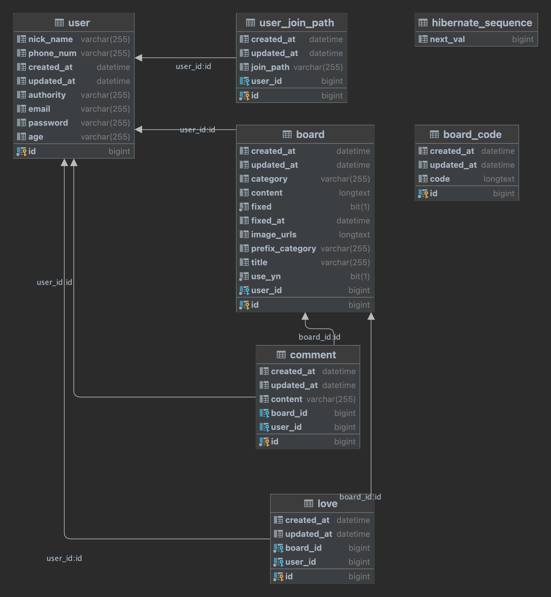
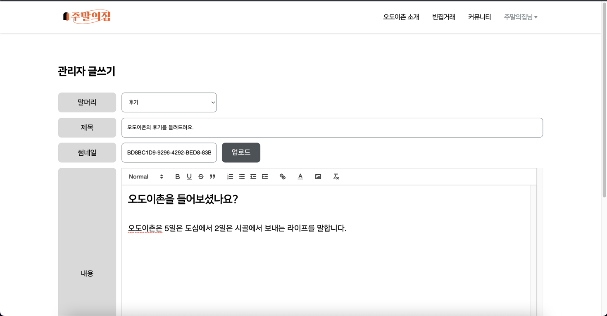

## 주말의집 - 듀얼 라이프 커뮤니티 플랫폼 🏠

  

### 프로젝트 설명

"주말의집"은 듀얼 라이프를 꿈꾸고 실천하는 사용자들 간의 커뮤니티 형성을 도와주는 플랫폼입니다.

본 프로젝트를 통해 아래와 같은 경험과 지식을 쌓고 있습니다.

- SpringBoot 와 Kotlin 기반의 웹 애플리케이션 생애 주기 기획부터 배포 및 운영까지 경험
- AWS 클라우드 환경 기반의 CICD 무중단 배포 인프라 구축 경험
- JPA, Hibernate를 사용한 도메인 설계 경험
- MVC 기반 애플리케이션 서버 구축
- SSR 방식의 백오피스 개발 경험

### 기술 스택
**어플리케이션 ( Language & Framework & Library )**
- Kotlin
- Spring Framework ( Spring Boot 2.7.8, Spring MVC )
- Spring Data JPA, Redis, QueryDsl
- Junit5, AssertJ, Mockito

**Build Tool**
- Gradle( Kotlin )

**Database**
- MySQL

**인프라**

- AWS Route 53
- AWS EC2
- Nginx, AWS S3, AWS CodeDeploy(Agent)
- AWS RDS
- Git, Github Actions
- CloudWatch, Slack
- Jacoco, SonarCloud
- Docker

**WEB**
- Javascript
- HTML/CSS
- Thymeleaf
- Bootstrap 5

**기타 주요 라이브러리**
- JWT
- Bucket4j

### E-R 다이어그램

### 핵심 기능 ( 배포 이후 )
**메모리 부족으로 인한 swap으로 가상 메모리 설정**

프리티어 환경에서 EC2 서버를 운영하면서 CD를 통해 배포하면 서버가 죽는 이슈가 발생했습니다. swap을 통해 가상 메모리 설정을 통해 해당 이슈를 해결하였습니다. 

**사용자 개인 정보 보호를 위한 암호화 처리**

회원가입과 로그인/로그아웃 관련 기능 구현 이후, 배포된 사이트를 통해 QA를 하면서 개인 정보 보호에 대한 걱정이 들었습니다.

실제 사용자가 접속해서 회원가입 과정을 거쳐 사이트에 제공하는 정보에 대해 제3자로부터 보호하는 것은 당연하지만, 이를 운영하는 관리자들로부터도 보호되어야 한다고 생각했습니다.

따라서 사용자 정보를 생성/수정/조회 시, 암호화와 복호화 처리를 거치도록 리펙토링하였습니다. DB에 콘솔로 접근하여 select 쿼리를 통해 조회하더라도 모든 데이터는 암호화 처리된 상태로 조회됩니다. 

리펙토링 과정은 [유저 테이블 암호화](https://github.com/ODOICHON/server/wiki/%5B%ED%94%84%EB%A1%9C%EC%A0%9D%ED%8A%B8-%EC%84%A4%EA%B3%84%5D-%EC%9C%A0%EC%A0%80-%ED%85%8C%EC%9D%B4%EB%B8%94-%EC%95%94%ED%98%B8%ED%99%94)에서 자세히 확인할 수 있습니다.

**사용자 탈퇴 이후의 처리**

사용자로부터 얻는 데이터로 운영되기 때문에 사용자가 탈퇴를 하더라도 개인정보를 제외한 데이터는 보유하고 있기로 하였습니다. 이를 위해 사용자 데이터를 delete 하는 것이 아닌 "" 공백 문자를 넣어 사용자 테이블과 Cascade가 걸린 다른 테이블의 데이터를 보존할 수 있도록 리펙토링하였습니다.

리펙토링 과정은 [유저 탈퇴 처리](https://github.com/ODOICHON/server/wiki/%5BAPI-%EA%B5%AC%ED%98%84%5D-%EC%9C%A0%EC%A0%80-%ED%83%88%ED%87%B4-%EC%B2%98%EB%A6%AC)에서 자세히 확인할 수 있습니다.

**리프레시 토큰 저장방식의 변경**

기능 개발 중에 JWT 토큰 형태의 Access-token과 Refresh-token을 Frontend에서 클라이언트의 localstorage에 관리했습니다. Server에서는 Redis 서버에 Refresh-token을 저장하여 관리했습니다.

유효기간이 긴 Refresh-token이 localstorage에 저장되면 XSS 공격 등으로 탈취 당할 위험이 있다고 판단하여 Cookie에 담아 저장하는 방식으로 변경하였습니다.

리펙토링 과정은 [리프레시 토큰 저장방식 변경](https://github.com/ODOICHON/server/wiki/%5B%EC%9D%B4%EC%8A%88%5D-%EB%A6%AC%ED%94%84%EB%A0%88%EC%8B%9C-%ED%86%A0%ED%81%B0-%EC%A0%80%EC%9E%A5%EB%B0%A9%EC%8B%9D-%EB%B3%80%EA%B2%BD)에서 자세히 확인할 수 있습니다.

### 핵심 기능 ( 기능 개발 중 )
**반응형 웹 화면**  
  
  
[사진 - 백오피스 중 관리자 페이지]  
Bootstrap을 이용하여 모바일 기기로 접속은 물론 모니터 화면에서도 문제없이 동작하는 반응형 웹으로 구현하였습니다.  

**백오피스**

주말의집을 운영하는 관리자만이 접속할 수 있는 백오피스를 SSR 방식으로 구현하였습니다.

SSR 방식을 선택한 이유는 제한된 접근자와 적은 수의 트래픽이 발생하기 때문에 개발 리소스를 최소화하기 위함이었습니다.

백오피스에서의 핵심 기능은 다음과 같습니다.

- 사용자 연령대별 비율, 사용자 가입경로 시각화
- 게시글 상단 고정 및 고정 해제
- 게시글 영구삭제

관리자 계정으로의 로그인은 Session 방식을 적용하였으며, interceptor를 통해 로그인이 필요한 페이지에 로그인 없이 접근하는 것을 불가능하게 하였습니다.

회원가입 시, 사용자로부터 얻은 데이터에 대한 통계적 자료를 확인하기 위해 연령대와 가입경로 데이터를 시각화하여 조회할 수 있도록 하였습니다.

홍보 게시판은 일반 사용자의 요청으로 관리자가 게시글을 상단에 고정할 수 있습니다. 한 번에 최대 10개의 게시글을 고정/고정해제 할 수 있으며 이는 위에 관리자 페이지 화면에 해당합니다.

일반 사용자가 접근할 수 있는 페이지에서의 게시글 삭제는 Soft delete 방식으로 DB에서 영구적으로 삭제되지 않습니다. DB에서 영구 삭제는 관리자만이 할 수 있으며 이를 위해 관리자 페이지에서 게시글 영구 삭제 기능을 구현하였습니다. 

백오피스 개발에 관련된 자세한 내용은 [관리자페이지 - server](https://github.com/ODOICHON/server/wiki/%5B%EA%B4%80%EB%A6%AC%EC%9E%90-%ED%8E%98%EC%9D%B4%EC%A7%80%5D-server)와 [관리자페이지 - client](https://github.com/ODOICHON/server/wiki/%5B%EA%B4%80%EB%A6%AC%EC%9E%90-%ED%8E%98%EC%9D%B4%EC%A7%80%5D-%08client-with-Thymeleaf) 에서 확인할 수 있습니다.

> `뒤에서 묵묵히 역할하는 관리자 페이지`는 지속적으로 업데이트 중입니다.

**로컬 로그인**

로컬 로그인 구현을 위해 Spring Security가 아닌 ArgumentResolver와 AOP를 커스터마이징하여 구현하였습니다.

@Auth 어노테이션으로 컨트롤러 메소드가 실행되기 전에 HTTP Request Authorization Header에 담긴 JWT 토큰에 대해 검증합니다.

@AuthUser 어노테이션으로 @Auth 어노테이션으로 검증된 토큰 값에 담긴 사용자의 아이디로 User를 찾은 후, 반환된 값을 컨트롤러 메소드의 Argument로 사용할 수 있습니다.

로컬 로그인 구현 과정은 [Spring Security 없이 인증인가 구현하기](https://github.com/ODOICHON/server/wiki/%5BAPI-%EA%B5%AC%ED%98%84%5D-Spring-Security-%EC%97%86%EC%9D%B4-%EC%9D%B8%EC%A6%9D%EC%9D%B8%EA%B0%80-%EA%B5%AC%ED%98%84%ED%95%98%EA%B8%B0)에서 확인할 수 있습니다.

**사용자 권한**

로컬 로그인을 통해 회원가입을 하는 사용자는 일반 사용자의 권한을 가지며, 관리자 권한을 갖는 사용자는 내부적으로 Authority를 ADMIN으로 부여하고 있습니다. 

일반 사용자는 게시글 조회/수정/삭제/생성 및 댓글 작성/수정/삭제, 좋아요 등의 기능을 수행할 수 있습니다.

관리자는 소개 페이지 내 후기/트렌드 게시글 작성/수정/삭제 권한을 가지며, 이는 일반 사용자에게 노출되지 않는 기능입니다.

관리자는 일반 사용자의 악의성 게시글 및 댓글에 대해 영구 삭제 권한을 갖고 있습니다.

**React-Quill 기반 게시글 작성**

글 작성 시, 아래 사진과 같이 사용자가 자유롭게 꾸밀 수 있는 에디터 형식을 지원합니다.

대표 썸네일 이미지와 게시글 내용에 포함되는 이미지에 대해서는 Frontend 측에서 AWS S3로 직접 업로드 처리합니다. 

이미지 업로드 후 url 주소에 대해서 Server로 게시글 내용과 함께 전달하여 DB에서 이를 관리합니다. 

**트러블 슈팅** (2023.04.17)  
게시글 테이블 데이터 최대 크기 초과 이슈가 발생했습니다. 

Board(Id, CreatedAt, UpdatedAt, Category, Code, Content, Fixed, FixedAt, ImageUrls, PrefixCategory, Title, UseYn, UserId )

게시글 테이블은 위와 같은 구조로 설계 되어 있었으며, Code 컬럼은 Frontend 측에서 넘어오는 HTML 태그가 포함된 데이터입니다. 

게시글 검색 시, 게시글의 제목과 내용에 대해 검색이 가능해야 했기에 게시글 데이터가 insert 되기 이전에 Code 데이터로부터 HTML 태그를 파싱해서 순수한 값만 갖는 Content 데이터를 별도의 컬럼으로 저장하여 관리합니다.

게시글 테이블 내에 이미 많은 컬럼이 존재하고, 사용자가 작성하는 게시글의 글자수 제한이 없기 때문에 Code와 Content 데이터의 크기가 하나의 Row가 가질 수 있는 범위를 넘어서면서 insert 오류가 발생했습니다.

이를 해결하기 위해 테이블을 분리하여 board와 board_code를 One-To-One으로 관리합니다.

해당 이슈의 발생 과정 및 해결 과정은 [게시글 테이블 데이터 크기 초과로 인한 테이블 분리 작업](https://github.com/ODOICHON/server/wiki/%5B%EC%9D%B4%EC%8A%88%5D-%EA%B2%8C%EC%8B%9C%EA%B8%80-%ED%85%8C%EC%9D%B4%EB%B8%94-%EB%8D%B0%EC%9D%B4%ED%84%B0-%EA%B8%B8%EC%9D%B4-%EC%B4%88%EA%B3%BC%EB%A1%9C-%EC%9D%B8%ED%95%9C-%ED%85%8C%EC%9D%B4%EB%B8%94-%EB%B6%84%EB%A6%AC-%EC%9E%91%EC%97%85)에서 자세히 확인할 수 있습니다.

**게시글 CRUD**

게시글에 대한 기본적인 CRUD를 모두 구현하였습니다. 게시글 작성은 위의 내용처럼 에디터 형식으로 게시글이 작성되어 등록되며, 조회 시에도 HTML로 파싱 후 렌더링 되어 보여집니다.

수정과 삭제의 경우, 관리자 유저와 게시글 작성자 본인에 대해서만 인가하여 권한을 제한하였습니다.

**Soft Delete 방식의 게시글 삭제**

사용자로부터 얻는 데이터를 중심으로 운영되는 서비스의 경우, 데이터가 곧 자산입니다. 데이터가 누적되어 그 안에서 유의미한 인사이트를 얻을 수 있고, 이것이 신규 기능이자 서비스로 발전될 수 있습니다.

기획의 요구사항 변경으로 삭제된 데이터를 다시 노출해야 하는 예기치 못한 상황에 대응하기 위해 Soft Delete 방식을 적용하기로 하였습니다.

이를 위해 게시글 테이블 내에 UseYn 컬럼을 두어 일반 사용자가 게시글을 삭제한 경우에는 조회되지 않고, 관리자 페이지에서 관리자가 삭제하는 경우에는 영구 삭제합니다.

soft delete 적용 과정은 [Soft Delete 방식 적용](https://github.com/ODOICHON/server/wiki/%5BAPI-%EA%B5%AC%ED%98%84%5D-Soft-Delete-%EB%B0%A9%EC%8B%9D-%EC%A0%81%EC%9A%A9%ED%95%98%EA%B8%B0)에서 자세히 확인할 수 있습니다.

**댓글과 좋아요**

게시글 내에 댓글 작성 기능을 제공하고 있으나, 대댓글 작성 기능은 제공하고 있지 않습니다.

게시글에 대해 좋아요 표시를 할 수 있으며 이 데이터를 통해 게시글 리스트 조회 시 필터링으로 사용됩니다. 

**말머리 데이터 관리**

일종의 카테고리라고 볼 수 있는 말머리 데이터에 대해서는 각 게시판 마다 고유의 말머리가 존재하며, 해당 데이터의 추가 및 삭제는 관리자만이 할 수 있습니다. 

해당 데이터는 서버 측 DB에서 관리하고 있으며 데이터의 변경에도 유연하게 대응할 수 있도록 Frontend에서 해당 데이터를 DB로부터 조회하여 화면에 노출합니다.

### REST DOCS 기반 API 명세서

- [사용자 API 명세서](https://odoichon.github.io/server/src/main/resources/static/docs/user.html)
- [게시글 API 명세서](https://odoichon.github.io/server/src/main/resources/static/docs/board.html)
- [댓글 API 명세서](https://odoichon.github.io/server/src/main/resources/static/docs/comment.html)
- [JWT 예외처리](https://odoichon.github.io/server/src/main/resources/static/docs/jwt.html)
- [좋아요 API 명세서](https://odoichon.github.io/server/src/main/resources/static/docs/love.html)
- [ErrorCode 명세서](https://odoichon.github.io/server/src/main/resources/static/docs/error.html)
 

### 기타 회고 및 문서화
- [은비 - 인프라 아키텍처 설계 및 구성 과정](https://github.com/ODOICHON/server/wiki/%5B%ED%94%84%EB%A1%9C%EC%A0%9D%ED%8A%B8-%EC%84%A4%EA%B3%84%5D-%EC%9D%B8%ED%94%84%EB%9D%BC-%EC%95%84%ED%82%A4%ED%85%8D%EC%B2%98-%EA%B5%AC%EC%84%B1)
- [태민 - 인프라 구축 및 무중단 배포 프로세스](https://github.com/ODOICHON/server/wiki/%5B%ED%94%84%EB%A1%9C%EC%A0%9D%ED%8A%B8-%EC%84%A4%EA%B3%84%5D-%EC%9D%B8%ED%94%84%EB%9D%BC-%EA%B5%AC%EC%B6%95-%EB%B0%8F-%EB%AC%B4%EC%A4%91%EB%8B%A8-%EB%B0%B0%ED%8F%AC-%ED%94%84%EB%A1%9C%EC%84%B8%EC%8A%A4)
- [태민 - 관리자 페이지(server)](https://github.com/ODOICHON/server/wiki/%5B%EA%B4%80%EB%A6%AC%EC%9E%90-%ED%8E%98%EC%9D%B4%EC%A7%80%5D-server)
- [태민 - 관리자 페이지(client with Thymeleaf)](https://github.com/ODOICHON/server/wiki/%5B%EA%B4%80%EB%A6%AC%EC%9E%90-%ED%8E%98%EC%9D%B4%EC%A7%80%5D-%08client-with-Thymeleaf)  
- [태민 - server health-check](https://github.com/ODOICHON/server/wiki/%5B%ED%94%84%EB%A1%9C%EC%A0%9D%ED%8A%B8-%EC%84%A4%EA%B3%84%5D-server-health-check) 
- [태민 - CI/CD workflow](https://github.com/ODOICHON/server/wiki/%5B%ED%94%84%EB%A1%9C%EC%A0%9D%ED%8A%B8-%EC%84%A4%EA%B3%84%5D-CI-CD-workflow)
- [은비 - ERD 설계](https://github.com/ODOICHON/server/wiki/%5B%ED%94%84%EB%A1%9C%EC%A0%9D%ED%8A%B8-%EC%84%A4%EA%B3%84%5D-ERD-%EC%84%A4%EA%B3%84)
- [은비 - Jasypt 라이브러리를 이용한 YML 파일 암호화하기](https://github.com/ODOICHON/server/wiki/%5Bproject%5D-Jasypt-%EB%9D%BC%EC%9D%B4%EB%B8%8C%EB%9F%AC%EB%A6%AC%EB%A5%BC-%EC%9D%B4%EC%9A%A9%ED%95%9C-YML-%ED%8C%8C%EC%9D%BC-%EC%95%94%ED%98%B8%ED%99%94%ED%95%98%EA%B8%B0)
- [은비 - 테스트 코드를 작성하는 이유](https://github.com/ODOICHON/server/wiki/%5B%ED%85%8C%EC%8A%A4%ED%8A%B8-%EC%BD%94%EB%93%9C%5D-%ED%85%8C%EC%8A%A4%ED%8A%B8-%EC%BD%94%EB%93%9C%EB%A5%BC-%EC%9E%91%EC%84%B1%ED%95%98%EB%8A%94-%EC%9D%B4%EC%9C%A0)
- [은비 - RestDocs 적용 과정](https://github.com/ODOICHON/server/wiki/%5B%ED%85%8C%EC%8A%A4%ED%8A%B8-%EC%BD%94%EB%93%9C%5D-RestDocs-%EC%82%AC%EC%9A%A9%EC%97%90-%EB%94%B0%EB%A5%B8-Controller-%EB%8B%A8%EC%9C%84-%ED%85%8C%EC%8A%A4%ED%8A%B8-(-e2e-Test-))

- [은비 - findByIdOrThrow 함수 커스터마이징하기](https://github.com/ODOICHON/server/wiki/%5BAPI-%EA%B5%AC%ED%98%84%5D--Select-%EC%BF%BC%EB%A6%AC-%EB%B0%9C%EC%83%9D-%EC%8B%9C,-Exception-%EC%B2%98%EB%A6%AC-%ED%95%9C-%EB%B2%88%EC%97%90-%ED%95%98%EA%B8%B0)
- [은비 - Jacoco + SonarlCloud 적용과정](https://github.com/ODOICHON/server/wiki/%5B%ED%94%84%EB%A1%9C%EC%A0%9D%ED%8A%B8-%EC%84%B8%ED%8C%85%5D-Jacoco-&-SonarCloud-%EC%A0%81%EC%9A%A9)
- [은비 - SonarCloud 세팅 중 마주한 이슈 정리](https://github.com/ODOICHON/server/wiki/%5B%EC%9D%B4%EC%8A%88%5D-SonarCloud-%EC%84%A4%EC%A0%95-%ED%8A%B8%EB%9F%AC%EB%B8%94-%EC%8A%88%ED%8C%85)
- [은비 - Github Actions와 SonarCloud 사용 중 트러블 슈팅 정리](https://github.com/ODOICHON/server/wiki/%5B%ED%8A%B8%EB%9F%AC%EB%B8%94%EC%8A%88%ED%8C%85%5D-Github-Actions---SonarCloud)

- [민혁 - DDOS 대응 방안](https://github.com/ODOICHON/server/wiki/%5B%ED%94%84%EB%A1%9C%EC%A0%9D%ED%8A%B8-%EC%84%A4%EA%B3%84%5D-DDOS-%EB%8C%80%EC%9D%91-%EB%B0%A9%EC%95%88)

### 버전 관리
🏷 VERSION 0.0.1 - 로그인/회원가입 API 연동 (2023.03.39)

🏷 VERSION 0.0.2 - 메인 페이지 화면 작업 및 소개 게시판 API 연동 (2023.04.25)

🏷 VERSION 0.0.3 - 백오피스 메인 기능 개발 (2023.04.xx)

### 팀 구성
| Name    | 
이은비
|
윤태민
 |
문민혁
 | 
| ------- | --------------------------------------------- | ------------------------------------ | --------------------------------------------- | 
| Profile | 
  
|

|

|
| Role    | 
Team Leader  Back-end, DevOps
   | 
Back-end,   DevOps
    | 
Back-end ,  DevOps
  | 
GitHub | 
[@dldmsql](https://github.com/dldmsql)
 | 
[@YoonTaeMinnnn](https://github.com/YoonTaeMinnnn) 
| 
[@MoonMinHyuk1](https://github.com/MoonMinHyuk1) 
|
